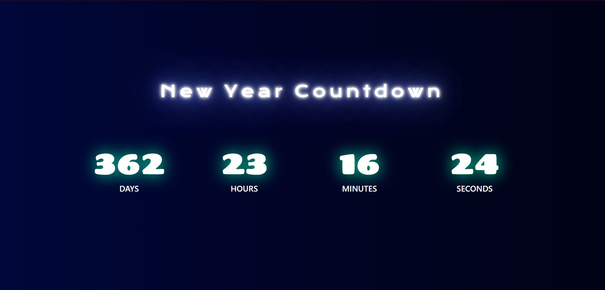
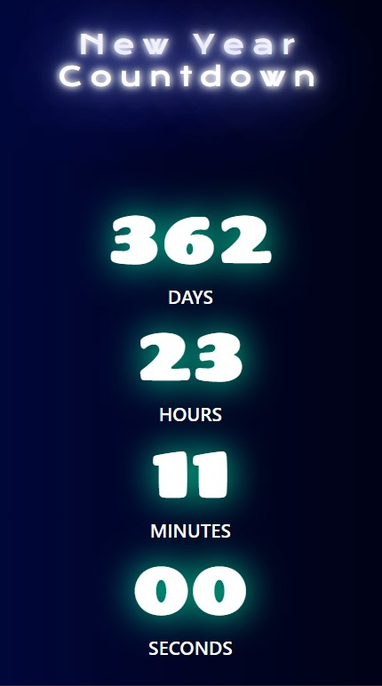

# New Year Countdown Timer

## Table of contents

- [Overview](#overview)
  - [The Description](#the-discription)
  - [Screenshot](#screenshot)
  - [Link](#Link)
- [My process](#my-process)
  - [Built with](#built-with)
  - [What I learned](#what-i-learned)
- [Author](#author)

## Overview

### Description 

Using HTLM, CSS and Javascript to create a New Year Countdown Timer according to the design given in the Screenshots folder. It will tell how many days, hours, minutes, seconds left for new year

### Screenshot

### Link

- Solution URL : [https://github.com/Anish010/New-Year-Countdown-Timer]
- Live Site URL : [https://new-year-countdown-001.netlify.app/]

## My process

### Built with

- Semantic HTML5 markup
- CSS custom properties
- Google Fonts
- Javascript

### What I learned

With the help of this project i able to practice my CSS ,HTML skills and javascript DOM skills very well. I also came to know about some new properties and new ways to design a web page.

## Author

- Linkedin - [Anish Kumar Mohanty](https://www.linkedin.com/in/anish-kumar-mohanty-68a019216/)
- Instagram - [@anish.mohanty\_](https://www.instagram.com/anish.mohanty_/)
